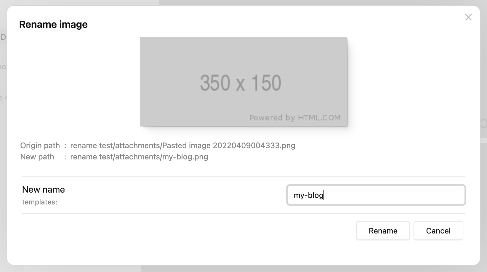

# Obsidian paste image rename

This plugin is inspired by Zettlr, Zettlr shows a prompt that allows the user to rename the image, this is a great help if you want your images to be named and organized clearly.

<details>
  <summary>Zettlr's prompt after pasting an image</summary>

  
</details>

Paste image rename plugin not only implements Zettlr's feature, but also allows you to customize how the image name would be generated, and eventually free you from the hassle by automatically rename the image according to the rules.

## How to use

### Basic usage

After installing the plugin, you can just paste an image to any document and the rename prompt will display:


By typing the new name and click "Rename" (or just press enter), the image will be renamed and the internal link will be replaced to the new name.

### Set `imageNameKey` frontmatter

While adding a lot of images to one document, people possibly want the images to be named in the same format, that's where `imageNameKey` is useful.

First set a value for `imageNameKey` in frontmatter:

```
---
imageNameKey: my-blog
---
```

Then paste an image, you will notice that the "New name" has already been generated as "my-blog", which is exactly the value of `imageNameKey`:


You can change the pattern for new name generating by updating the "Image name pattern" value in settings.

For detailed explanation, and other features such as auto renaming, please refer to [Settings](#settings).

## Settings

- Image name pattern

  The pattern indicates how the new name should be generated.

  - Available variables:
    - `{{imageNameKey}}`: this variable is read from the markdown file's frontmatter, from the same key `imageNameKey`.
    - `{{DATE:$FORMAT}}`: use `$FORMAT` to format the current date, `$FORMAT` must be a Moment.js format string, e.g. `{{DATE:YYYY-MM-DD}}`

  - Examples of pattern to results :
    > (imageNameKey = "foo")
    - `{{imageNameKey}}-`: foo-
    - `{{imageNameKey}}-{{DATE:YYYYMMDDHHmm}}`: foo-202204081652
    - `Pasted Image {{DATE:YYYYMMDDHHmm}}`: Pasted Image 202204081652
- Duplicate number at start (or end)

  If enabled, duplicate number will be added at the start as prefix for the image name, otherwise it will be added at the end as suffix for the image name.
- Duplicate number delimiter

  The delimiter to generate the number prefix/suffix for duplicated names. For example, if the value is `-`, the suffix will be like "-1", "-2", "-3", and the prefix will be like "1-", "2-", "3-".
- Auto rename

  By default, the rename modal will always be shown to confirm before renaming, if this option is set, the image will be auto renamed after pasting.
